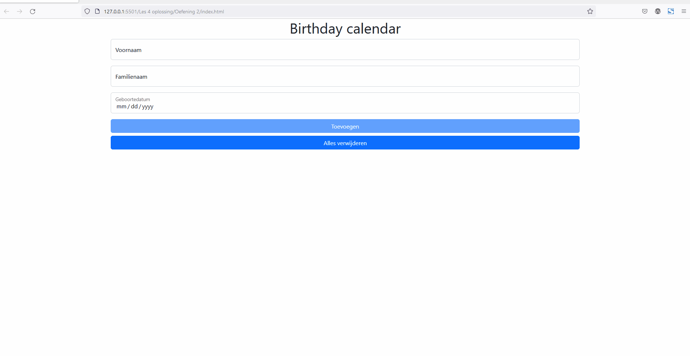

# Oefening 2

Maak met behulp van de gegeven code een verjaardagskalender.

Wanneer je de verjaardagskalender opent, worden de gegevens ingelezen uit de localstorage. Deze worden in de dates div geplaatst. Je mag zelf kiezen hoe je deze het beste toont.

Met behulp van de inputvelden en de toevoegen knop kan je een verjaardag voor een persoon toe voegen. Zorg er ook telkens voor dat nieuwe data opgeslagen wordt in localstorage.

Tot slot voorzie je nog dat de knop verwijder alles, alle data verwijdert uit localstorage.

Denk ook aan validatie of een andere manier om af te dwingen dat er data in de velden is ingevuld alvorens toe te voegen.

## Uitbreidingen

- Sorteer de data en groepeer deze per maand
- Plaats de dichtstbijzijnde verjaardag bovenaan
- Voorzie een manier om verjaardagen uit de lijst te verwijderen.

## Voorbeeld

