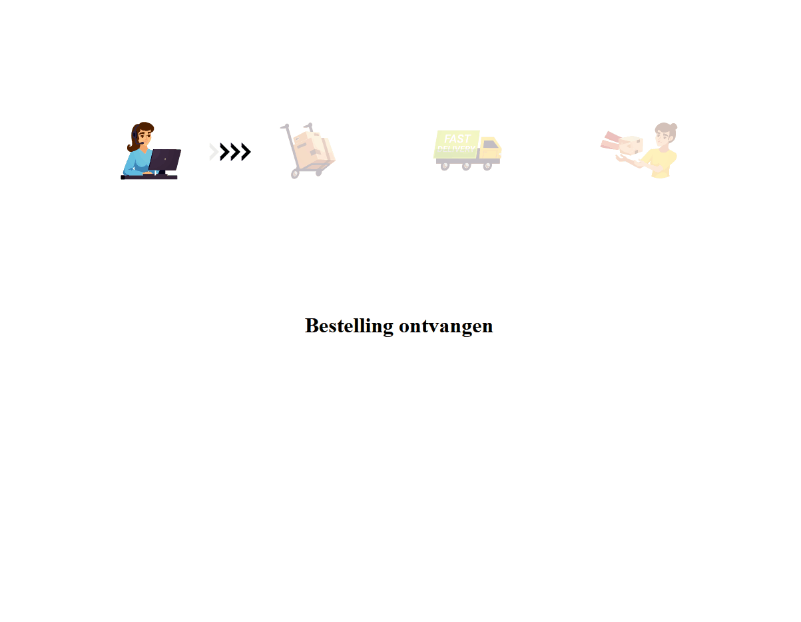

# Oefening 1

Maak een simulatie voor een leverbedrijf.

Op de website kan je zien in welke fase de levering zich bevind. We maken een simulatie dus we binden ons niet aan echte data.

In stap 1 wordt er getoond dat de bestelling ontvangen is. Na 5 seconden, wordt er getoond dat de bestelling verwerkt wordt.
2 seconden later, wordt de bestelling verzonden en tot slot na nog eens 5 seconden komt de bestelling aan.

Met behulp van css classlist kan je bepalen welke status de pijl heeft.
Met een class start, wordt de animatie getoond. Met een class hide kan je de pijlen verbergen.

Voor images is er ook een class deselected om images een opacity te geven.

Maak eerst de oefening door enkel gebruik te maken van promises. Maak nadien de oefening met behulp van async await.

